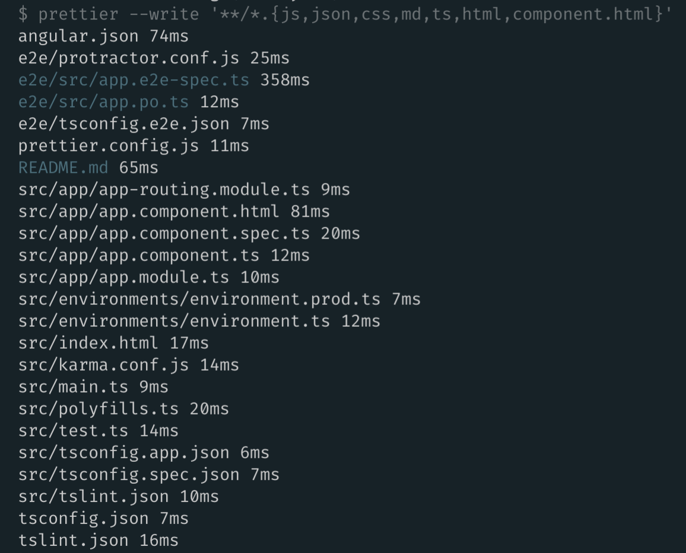
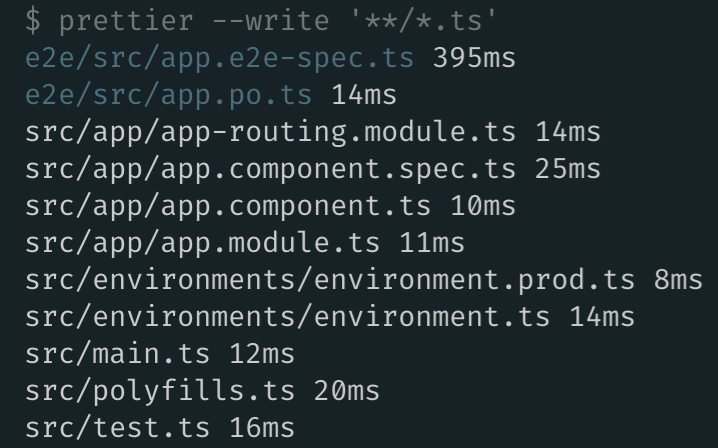
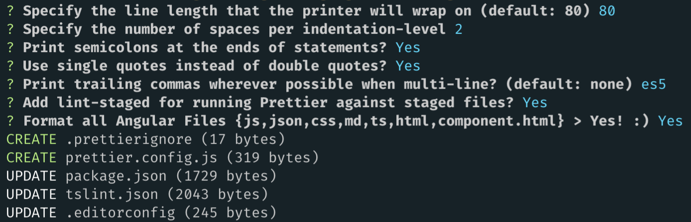

# Angular Prettier schematic

A Schematic that adds prettier and a pre-commit hook for formatting staged files.

[](https://circleci.com/gh/schuchard/prettier-schematic)
[](https://www.npmjs.com/package/@schuchard/prettier)
[](http://commitizen.github.io/cz-cli/)

## Usage 🚀

Run in an Angular CLI project

```bash
ng add @schuchard/prettier
```

or install globally

```shell
npm install -g @schuchard/prettier
```

then in an Angular CLI project:

```shell
ng g @schuchard/prettier:add
```

## How does Prettier work with Angular

### Automatically against staged files

By default [lint-staged](https://github.com/okonet/lint-staged) is [configured](https://prettier.io/docs/en/precommit.html#option-1-lint-staged-https-githubcom-okonet-lint-staged) along with a pre-commit hook. This will run Prettier against all new files as they are committed according to the settings defined in `prettier.config.json`. Generally speaking, your workflow should remain unchanged - `git add, commit, push`


#### Disabling lint-staged install

lint-stage and the precommit hook can be disabled with the following

```shell
ng g @schuchard/prettier:add --lintStaged=false
```

### Manually

While lint-staged only runs prettier against staged files, you can manually run Prettier against **ALL** [targeted](#Angular-formatting) files with the script added to the `package.json`

`npm run prettier`

## Angular formatting

Beginning with [1.15](https://prettier.io/blog/2018/11/07/1.15.0.html#html-vue-angular), Prettier supports formatting HTML and Angular files.

### Format all Angular Files - `{js,json,css,md,ts,html,component.html}`



### Format only Typescript files

Previous versions of this schematic only formatted Typescript files. That functionality is still available and is configured in the CLI prompts or via the `--formatAllAngularFiles=false` if desired. The default is `true`.



## Default Prettier options

### Angular 7

This schematic takes advantage of CLI [prompts](https://github.com/angular/angular-cli/blob/fb4e8187824fe66e50b42c16f95458e82b4787a8/docs/specifications/schematic-prompts.md) for configuring Prettier options. If you're unsure of a setting, press enter to select the default. You can skip a prompt by passing any of the options when call the schematic.

`ng g @schuchard/prettier:add --printWidth=100`



### < Angular 7

Without any CLI arguments the [default](https://prettier.io/docs/en/options.html) Prettier options will be applied. The defaults can be changed in one of two ways:

- modifying the `./prettier.config.js` after the schematic runs
- passing a flag to the schematic with the desired value for any of the options. For example:
  - `ng g @schuchard/prettier:add --printWidth=100 --tabWidth=4`

### Example default `prettier.config.js`

```json
printWidth = 80;
tabWidth = 2;
useTabs = false;
semi = true;
singleQuote = false;
trailingComma = "none";
bracketSpacing = true;
jsxBracketSameLine = false;
arrowParens = "avoid";
rangeStart = 0;
rangeEnd = Infinity;
requirePragma = false;
insertPragma = false;
proseWrap = "preserve";
lintStaged = true;
```

## Contributing

### Getting started

Install dependencies:

```shell
yarn && cd sandbox && yarn
```

Test changes to the schematic

```shell
yarn dev
```

Test changes to the schematic AND run E2E tests in the sandbox

```shell
yarn test
```

Reset the sandbox state after running the schematic locally

```shell
yarn clean
```

## Updating the Sandbox

1. remove the `/sandbox` directory
2. `npm i -g @angular/cli`
3. `ng new sandbox`
4. update the `package.json`

```
"build": "ng build --prod --progress=false",
"test": "ng test --watch=false",
```

## Documentation

Unsure how to do something with schematics? Check the Angular [schematics](https://github.com/angular/angular-cli/tree/master/packages/schematics/angular) for inspiration.

Inspiration came from this excellent article by [Aaron Frost](https://medium.com/ngconf/ultimate-prettier-angular-cheatsheet-777c9515f4fb)

## Publishing

- First, ensure you're authenticated with `npm login`.

```shell
npm run release
```

## Issues & Requests 📬

Submit an [issue](https://github.com/schuchard/prettier-schematic/issues/new/choose)
