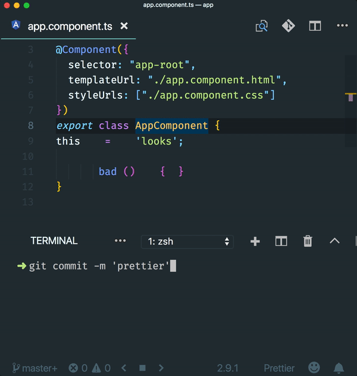

# Angular Prettier schematic

Schematic that adds prettier and a pre-commit hook for formatting staged files.

[](https://circleci.com/gh/schuchard/prettier-schematic)
[](https://www.npmjs.com/package/@schuchard/prettier)
[](https://github.com/semantic-release/semantic-release)
[](http://commitizen.github.io/cz-cli/)

## Usage 🚀

Install globally
```shell
npm install -g @schuchard/prettier
```

Then in an Angular CLI root directory:

```shell
ng g @schuchard/prettier:add
```

## Defaults

Without any CLI arguments the [default](https://prettier.io/docs/en/options.html) Prettier options will be applied. The defaults can be changed in one of two ways:

- modifying the `./prettier.config.js` after the schematic runs
- passing a flag to the schematic with the desired value for any of the options
  - `ng g @schuchard/prettier:add --printWidth=100 --tabWidth=4`

```json
printWidth = 80;
tabWidth = 2;
useTabs = false;
semi = true;
singleQuote = false;
trailingComma = "none";
bracketSpacing = true;
jsxBracketSameLine = false;
arrowParens = "avoid";
rangeStart = 0;
rangeEnd = Infinity;
requirePragma = false;
insertPragma = false;
proseWrap = "preserve";
lintStaged = true;
```

## Running Prettier

### Lint-staged

By default [lint-staged](https://github.com/okonet/lint-staged) is [configured](https://prettier.io/docs/en/precommit.html#option-1-lint-staged-https-githubcom-okonet-lint-staged) automatically along with a pre-commit hook. This will run Prettier against all new files as they are committed.



lint-stage and the precommit hook can be disabled with the following

```shell
ng g @schuchard/prettier:add --lintStaged=false
```

## Contributing

### Getting started

Install dependencies:

```shell
yarn && cd sandbox && yarn
```

Link schematic to sandbox app. Schematic commands in the sandbox will use this local repo schematic.

```shell
yarn link && yarn link:sandbox
```

### Committing ✅

This repo uses semantic-release and relies on [formatted](https://github.com/semantic-release/semantic-release#commit-message-format) commit messages for determining the next version. After staging changes, build the commit message with commitizen:

```shell
yarn cm
```

## Documentation

Unsure how to do something with schematics? Check the Angular [schematics](https://github.com/angular/angular-cli/tree/master/packages/schematics/angular) for inspiration.

Inspiration came from this excellent article by [Aaron Frost](https://medium.com/ngconf/ultimate-prettier-angular-cheatsheet-777c9515f4fb)

## Publishing

- First ensure you're authenticated with `npm login`.

```shell
npm run release
```

## Issues & Requests 📬

Submit an [issue](https://github.com/schuchard/prettier-schematic/issues/new/choose)